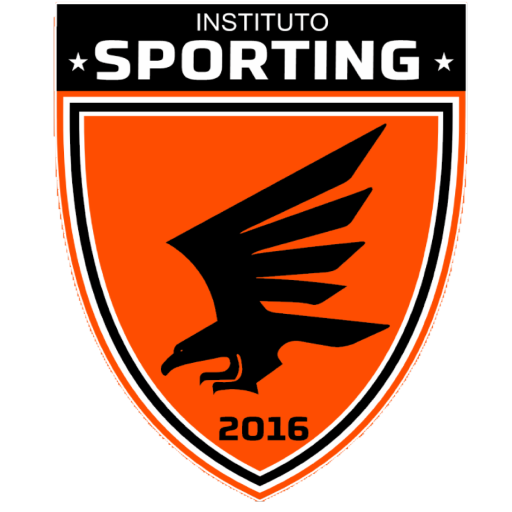

# 🏆 Instituto Sporting - Website Oficial

  <strong>Website institucional desenvolvido para o Instituto Sporting.</strong>

  🌐 <a href="https://institutosporting.com.br/" target="_blank">Acessar o projeto</a>

---

## 📖 Sobre o Projeto

O **Instituto Sporting** é um projeto desenvolvido para apresentar a instituição, divulgar seus atletas e facilitar a atualização de informações através de um sistema simples e eficiente.

Este projeto foi desenvolvido em parceria com meu irmão, participando desde a criação da interface até a implementação das funcionalidades e publicação em produção.

Além do desenvolvimento visual, o projeto foi pensado para oferecer uma navegação intuitiva, responsividade e facilidade na administração do conteúdo.

---

## 🚀 Funcionalidades

- ✅ Página inicial moderna e responsiva
- ✅ Apresentação institucional
- ✅ Exibição de atletas
- ✅ Carrossel de atletas
- ✅ Organização das informações do clube
- ✅ Atualização dinâmica de conteúdo
- ✅ Layout adaptado para dispositivos móveis
- ✅ Navegação otimizada
- ✅ Estrutura preparada para SEO

---

## 💻 Tecnologias Utilizadas

- HTML5
- CSS3
- JavaScript
- PHP
- MySQL
- Bootstrap
- Git
- GitHub

---

## 📱 Responsividade

O projeto foi desenvolvido para funcionar em:

- 💻 Desktop
- 📱 Smartphones
- 📲 Tablets

---

## 🎯 Objetivos do Projeto

- Desenvolver um site profissional para uma instituição esportiva.
- Melhorar a presença digital do Instituto Sporting.
- Facilitar a divulgação de atletas.
- Criar uma plataforma de fácil manutenção.
- Proporcionar uma boa experiência para os usuários.

---

## 👨‍💻 Minha Participação

Durante o desenvolvimento participei de:

- Desenvolvimento Front-end
- Desenvolvimento Back-end
- Estruturação das páginas
- Responsividade
- Integração das funcionalidades
- Organização do projeto
- Testes
- Publicação do site

---

## 📷 Demonstração

### Página Inicial

> *(Adicione aqui uma captura de tela da Home.)*

---

### Página de Atletas

> *(Adicione aqui uma captura de tela da página dos atletas.)*

---

## 🌐 Projeto Online

Acesse:

https://institutosporting.com.br/

---

## 📈 Aprendizados

Este projeto contribuiu para o desenvolvimento de habilidades como:

- Desenvolvimento Web
- Estruturação de projetos
- Responsividade
- Organização de código
- Trabalho em equipe
- Resolução de problemas reais
- Deploy de aplicações
- Versionamento com Git

---

## 📌 Melhorias Futuras

- Área administrativa mais completa
- Sistema de autenticação
- Dashboard para gerenciamento
- Melhorias de desempenho
- Novas funcionalidades para atletas e usuários

---

## 🤝 Agradecimentos

Agradeço ao Instituto Sporting pela confiança no desenvolvimento do projeto e ao meu irmão pela parceria durante todas as etapas do desenvolvimento.

---

## 👨‍💻 Desenvolvido por

**Thárley Araújo Silva**

LinkedIn:
www.linkedin.com/in/thárley-silva

GitHub:
https://github.com/SEU-USUARIO

---

⭐ Caso tenha gostado deste projeto, deixe uma estrela no repositório!
